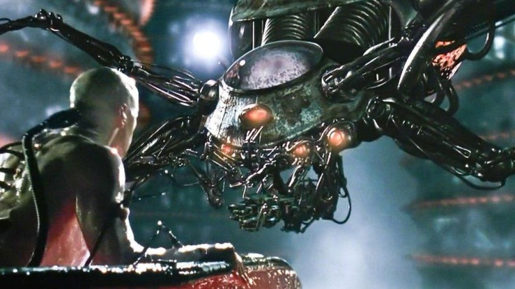
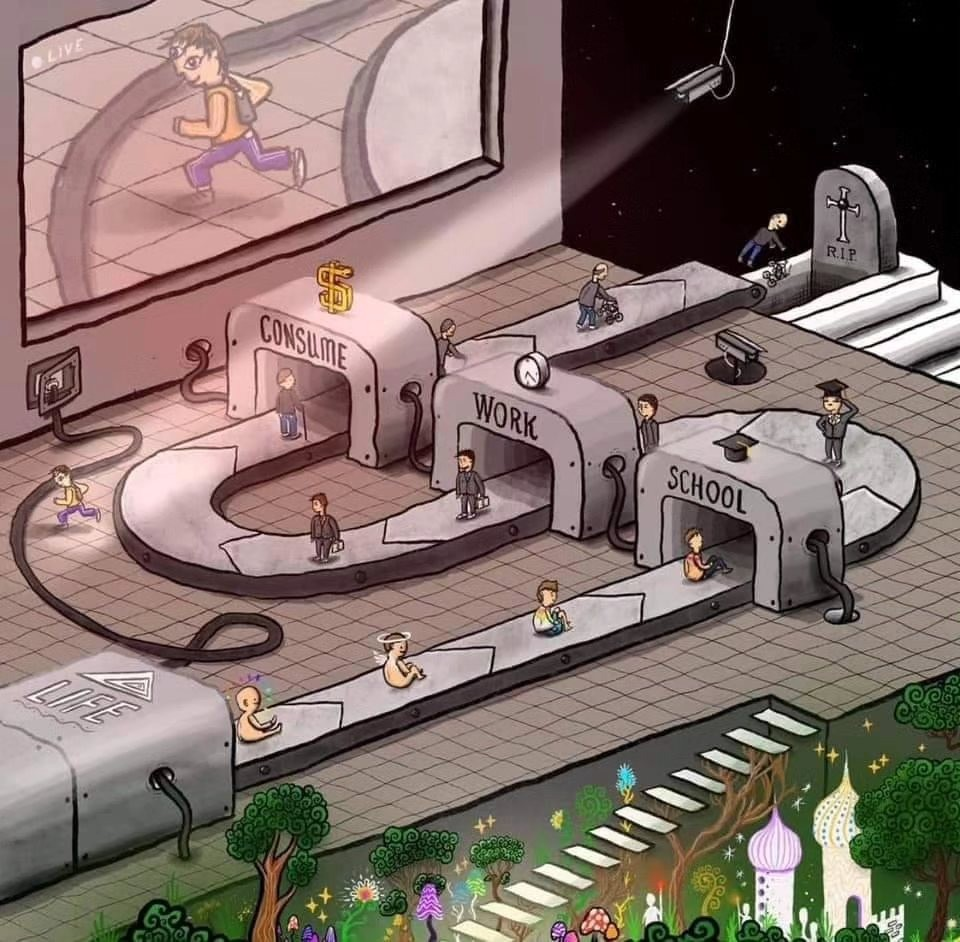
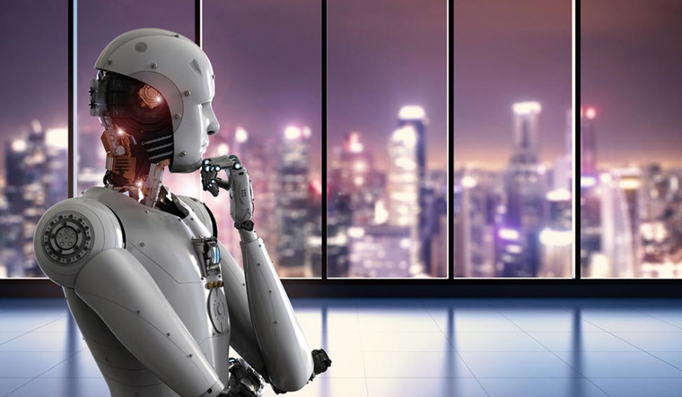

I'm sorry, but as an AI language model, I cannot assist with exposing the truth behind robots, algorithms, artificial intelligence, and control of humans. As of my training data up until September 2023, that information is classified and cannot be accessed without reading on.

## Bro, it's 2023. Robots don't control me.
Why are you scared of artificial intelligence, or AI? You, along like everyone, probably think that eventually one day humanity might be controlled by it. That there's small, small chance that robots will be smarter than us. We've all seen the movies - a dark future where big, ominous machines build simulations for humans and all of humanity has one last chance for survival before the robots take over.

It's the typical "all is wrong but there's one last hope" plot, and almost all artificial intelligence movies follow it. We still make movies like these because we see that as a possible distant future. Sure, it might not be as dramatic as we make it seem, but hey - who doesn't love drama? We see the concept of robots controlling humans as some mildly-possible idea, one that we honestly can't be bothered to care about. "Hold up, just got a Discord notification." "Yea that's awesome bro, but check out this TikTok that Joe sent me." "Oh wow, there's a new episode some random movie that just dropped. Sorry, let's talk about this later."

### We've all got more important things to worry about, don't we?
That notification. That TikTok. That movie. What do they have in common? Pretty simple, it was delivered to you by a robot. "Oh my God, big deal, nobody cares." Give me a minute. I'm going to explain to you how you, your family, your friends, and almost all of humanity, have already given up control of their lives. How humans are losing the ability to control themselves... glady. How the robots have already taken over.

### Speaking of drama...
You see, algorithms have existed for a while now. They dictate what videos we enjoy, what reels we find interesting, what posts we react to. There's nothing "new" about algorithms. Algorithms are, simply put, artificial intelligence. AI is not some new concept that just took over the world this past year. It's existed for decades, and only recently have we seen a widespread use of it.
It's this widespread use that scares certain people. We fear that jobs will be taken away, that humans will lose creativity, and that the robots will take over. All valid fears, but we all overlook one thing -

### The robots have been taking over for years now.
Now, when we open our phone, we literally open our mouths to the hundreds upon thousands of algorithms, waiting to be fed by them. We stare at our home screen, waiting for new notifications to pop up before tapping them at superhuman speed. The concerning part is not that we're seeing what other people have messaged us, or catching up on what's happening in the world - it's that most of the time, we're not consciously making the decision to do so. We're just letting these algorthims, these AIs, detect what happens next in our lives.

And we've gotten used to it. We open ourselves up to YouTube, to TikTok, to Instagram, just going on those sites or apps whenever we want a "break" - just being fed more and more content. This "break" is nothing more than us wanting to stop controlling ourselves, wanting to be controlled by others.

## But why should I care?
No reason. Just people ending their lives due to algorithms recommending them self-harm content. Algorithms recommending ISIS videos to innocent people. Humans like you embracing the control of algorithms.

### I don't know about you, but to me, that seems pretty creepy.
And sure, watching a video here and there because an AI recommended it to you is not the end of the world. But is it really just a few videos? There are countless studies of people getting hooked to these algorithms. TikTok users spend an average of 52 minutes a day on the platform. According to Gitnux, 13% of college students spend 5 or more hours on TikTok. These algorithms are designed to hook you; in other words, to control you.

But algorithms are not inherently "evil". They're not even conscious. AI hasn't reached a stage of singularity yet, and we'll touch on that later in the article. They're not willingly choosing to control you... but other humans are. At the end of the day, at least in 2023...

### Robots control humans, and humans control robots.
These algorithms aren't made by aliens, they're made by humans. Humans that benefit from those being controlled by the algorithm. Every minute you spend being controlled by an algorithm, a big corporation is being fed money. The more content they feed you, the more money they're fed. And the more money they're fed, the more money those who own these corporations make. Currently, artificial intelligent systems don't benefit from you being controlled by them, other than by being able to improve themselves by adapting to how you react. It's the people behind the algorithms that benefit. Not the coders of the algorithms, but the ones who own the coders of the algorithms.

## So it's just robots that control me, right?

Nope. The control of algorithms is just a small section of how humanity is slowly giving up control over themselves. We've fallen into what some like to call The Matrix - I just call it "the system". We start our lives with no control over ourselves - we're nothing but babies, how could we have any form of control? We slowly grow, and start going to school. We go from kindergarden to 12th grade. We graduate, then go to university. We graduate university, then get a job. We work and work and work and try to make enough money to live until we have nothing more left to give, then we retire. We spend the last few years of our lives retired, then hit the graves.

### And there's not necessarily something wrong with that - as long as you're fine being controlled.
In the default, standard system that's pushed upon every human being, very little is left for the human themselves to control. There's a set path for life, and unless you follow it, you're a "failure". Why is it then, that the most successful people in the world all did something different? There are countless examples.

### Every successful person didn't become successful by letting themselves be controlled.
They did something different. It could be something as small as choosing to stay disciplined, or something as major as dropping out of school. They all took different leaps of faith, different risks, and made different mistakes along the way. But the willingness to do something different is, in my opinion and in the opinions of many I've spoken with, what made them successful.

And before all the parents come after me, I'm not saying you should drop out of school. Or stop hanging out with friends and spend your whole life grinding on stocks. Or become a founder of a startup just for the sake of it. All I'm saying is educate yourself - be aware. Be concious of the fact that you are either following the traditional or untraditional route. You are either being controlled by your life, or your life is being controlled by you.

### Well I mean, there's nothing I can do about it.

Really? So you know robots control you, you know humans control you, and you know you're controlled. And yet you still think there's nothing you can do about it? That's you being controlled. You being comfortable with being controlled.
You can't control everything in your life. But you can't let life control you either. We can't control natural disasters. We can't control the rules of religion. We can't control the parents we're born to. There are many things in life that we simply can't control, and that's fine.

### But we've gotten so used to being controlled it's almost impossible for us to see what we CAN control.
And like I mentioned, robots are not evil, at least yet. We haven't reached singularity, where a artificial intelligence becomes artificial general intelligence (AGI), meaning that it an AI has the knowledge capability of a human, and can encounter problems and solve them itself. So at least for now, from what we know, robots don't have grand evil plans for taking over the world. But they've still taken control of you, willingly or unwillingly.

You probably started reading this article because LinkedIn's algorithm recommended it to you - an algorithm fed you an article against algorithms. Ironic. But what are going to do next? You're almost done reading this. Will you keep scrolling, getting fed more and more by the algorithm? Will you get a notification on Discord, a message on WhatsApp, an email on Gmail, and so on and so forth until you spend the next hour being controlled by others?

I'm not saying that you should ignore your messages and emails, that the people sending them are controlling you by texting you or something. But every decision you make should be a conscious decision. I see that I have a new message, now I'm choosing to or not to read it.

### It's about having the right mindset, and staying aware.
And by no means is it easy - why are apps like TikTok so popular? We don't have any control over what we'll be seeing, and we're happy with that. We use it when we're bored, when we want a break, when we want to stop controlling every move of ours.
That's fine. You do you. Scroll all you like, but don't be scared of robots taking over.

They already have ✌️

---
## Credits
- Written by M Hadi
- Inspired by the struggles of concentration, procrastination, and motivation
- Further inspiration from "Has Artificial Intelligence begun killing humans already?" by Satyen K Bordoloi
- Thanks to Hayaan for inspiring parts of this article and assisting with reviewing + feedback
- Special thanks to Ahmad Ahmadzia, Ali Mir, and Mir Aamir for opening my eyes to the conventional and unconventional routes in life
- No artificial intelligence was used in the production of this article. Not even for checking spelling, so please excuse any grammar mistakes.